# SDDMM Project

### List of matrices we have until now

#### Dense matrices

|    Matrix     |    Rows    |   Cols   |  Non-Zero  | Density |                  Image                   |
|:-------------:|:----------:|:--------:|:----------:|:-------:|:----------------------------------------:|
| Human Gene 2  |   14,340   |  14,340  | 18,068,388 |  8.8%   |  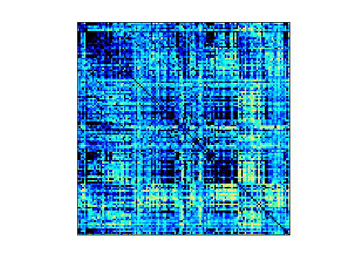  |
|     ND12k     |   36,000   |  36,000  | 14,220,946 |   1%    |     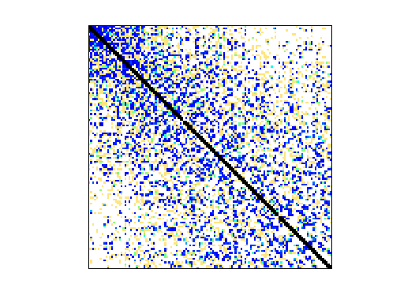     |
|   Platform    |  	28,924   |  28,924  | 2,043,492 |  0.25%  |   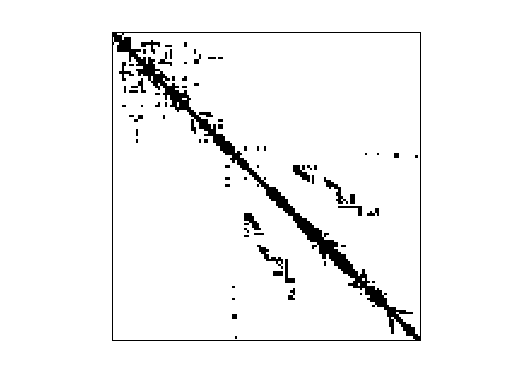    |
|   Mecanics    |  	 29,067  |  29,067  | 2,081,063 |  0.24%  |   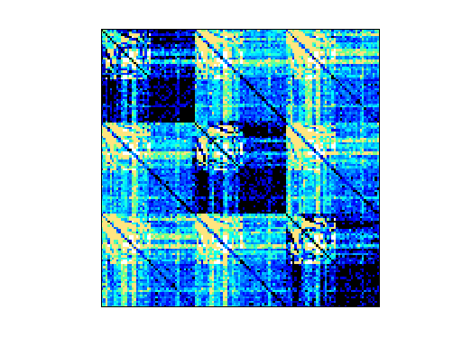    |
|     Power     |  	  	8,140  |   	8,140  |  	2,012,833 |  3.03%  |     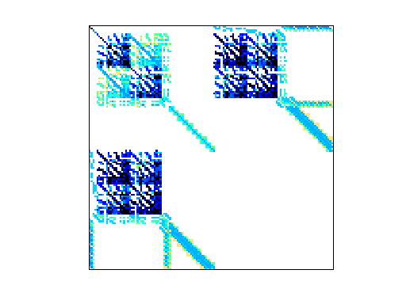     |
| Combinatorics |  	  	4,562  |  5,761  |  	2,462,970 |  9.37%  | 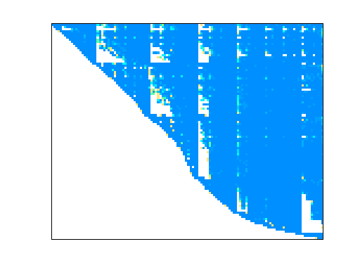 |
|    Stress     |  	  	25,710 | 25,710  |  	3,749,582 |  0.56%  |    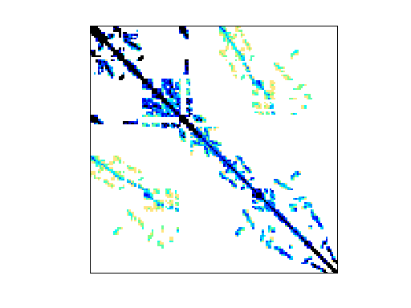     |
|     Mouse     |  	  45,101 | 45,101  |  	 	28,967,291 |  1.42%  |     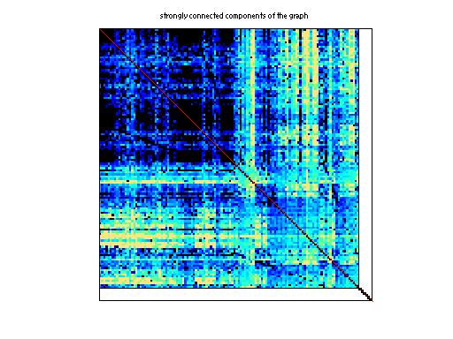     |

#### Sparse Matrices

|     Matrix      |   Rows    |   Cols    |  Non-Zero  | Density  |                   Image                    |
|:---------------:|:---------:|:---------:|:----------:|:--------:|:------------------------------------------:|
|   Email enron   |  36,692   |  36,692   |  367,662   |  0.027%  |   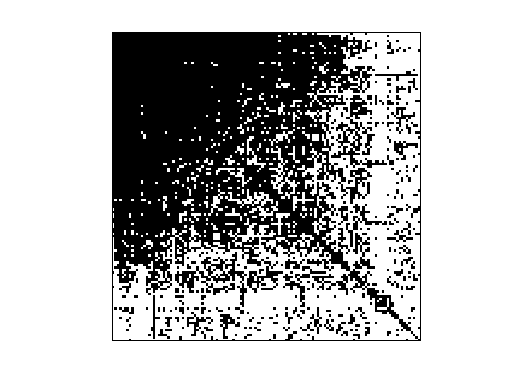   |
|     Boeing      |  52,329   |  52,329   | 2,600,295  |  0.09%   |     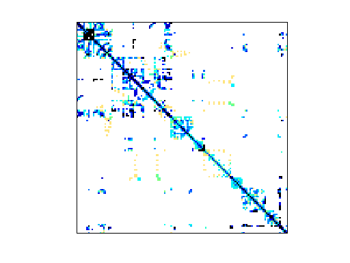      |
| Boeing Diagonal |  217,918  |  217,918  | 11,524,432 |  0.02%   | 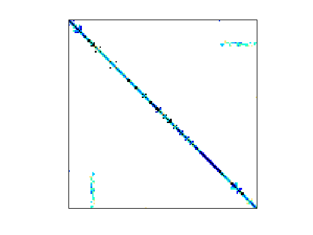 |
|    Stiffness    |  503,712  |  503,712  | 36,816,170 |  0.014%  |    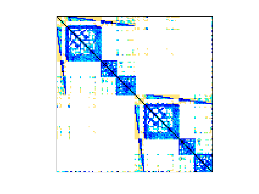    |
|     Stokes      | 1,090,664 | 1,090,664 | 34,767,207 | 0.0029%  |     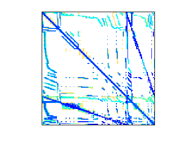      |
|      VLSI       | 1,453,908 | 1,453,908 | 37,475,646 | 0.0017%  |      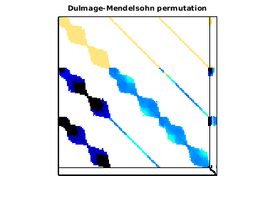       |
| Stack overflow  | 2,601,977 | 2,601,977 | 36,233,450 | 0.00053% |  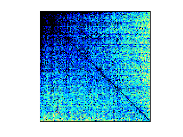  |
|      Chip       | 2,987,012 | 2,987,012 | 26,621,983 | 0.00029% |      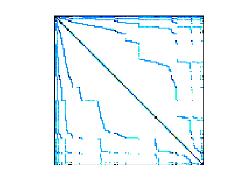       |
